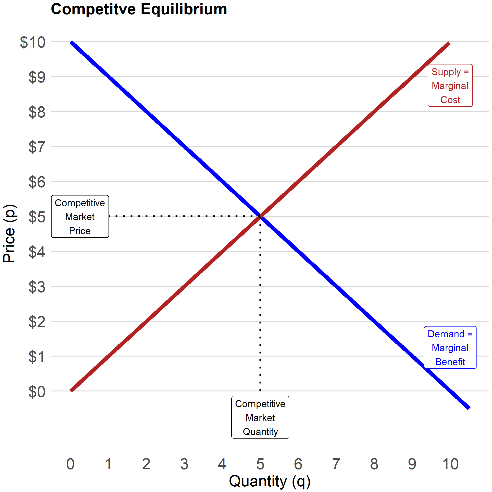
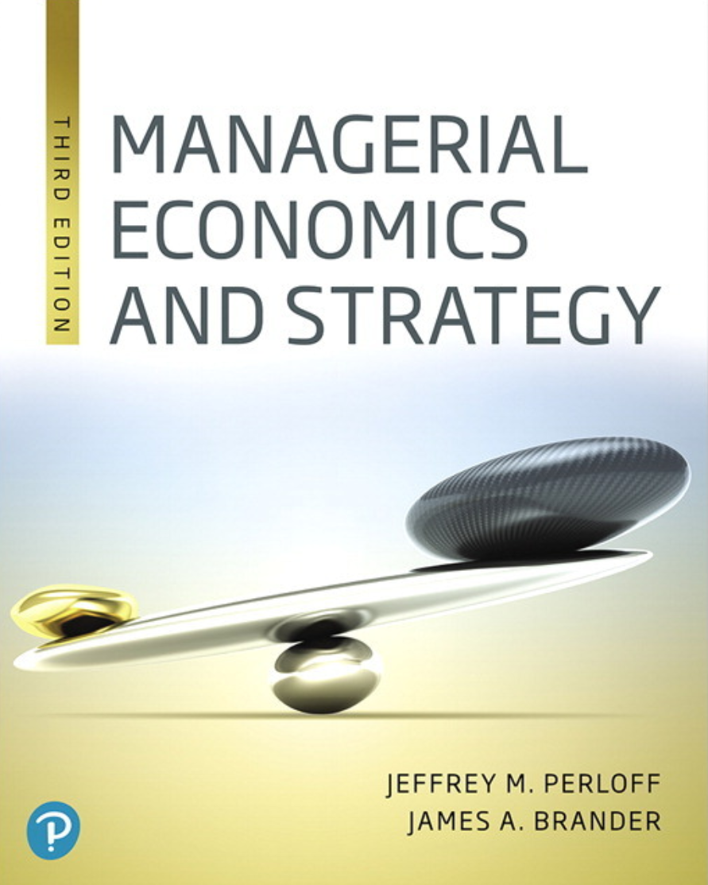

```{r setup, include=FALSE}
options(htmltools.dir.version = FALSE)
knitr::opts_chunk$set(echo=F,
                      message=F,
                      warning=F,
                      fig.retina=3,
                      fig.align = "center")
library("tidyverse")
library(RefManageR)
library(tidyverse)
library(ggthemes)
library(gridExtra)
library(gt)
library(grid)
library(kableExtra)
library(lubridate)
theme_slides <- theme_light() + 
  theme(
    text = element_text(family = "Fira Sans", size = 24)
  )

#u of a palette
colors_ua10 <- function()
{
  #return(c("#007C41", "#FFDB05", "#7D9AAA", "#CA7700", "#165788", "#A8B400",
  #         "#E0D760", "#404545", "#8D3C1E", "#004250"))
  c("#007C41", "#FFDB05", "#7D9AAA","#165788","#404545","#8D3C1E","#3CB6CE")
}

```


# Learning Objectives

.pull-left[
- The language of economics
- Economics as a tool for decision making
- Micro vs macro vs managerial economics
- Why economic models are wrong
- When and why we use them
]

.pull-right[

  
]

---


# *Micro*-economics

.pull-left[
- individual and firm decision-making

- prices

- labour market decisions

- strategic behaviour and game theory
]

.pull-right[

- sports (?!?!)

- marriage (?!?!)

- criminal behaviour (?!?!)

- pollution (?!?!)
]

---

# Micro- vs. Macro-economics

.pull-left[

- What is "an economy?"

- Where do aggregates (GDP, unemployment, & inflation) come from? 

- Micro: Choices and consequences

- Macro: Systemic interaction of choosers & emergent behavior
  - Macro is what happens when you put all the micro together

]

.pull-right[

]


---

# What does an economist mean when they say...

.pull-left[

- Terms you "know" from ordinary life mean .hi[very different things] to economists:

> Cost, efficiency, welfare, marginal, profit, public good, discrimination, elasticity, games

- Using these words' "ordinary" meanings will lead to wrong economic conclusions!

- You will need to "relearn" the economic meanings of these words
]

.pull-right[

.center[

]
]

---

# Economics has its own vocabulary

.pull-left[

- You'll need to master a new vocabulary:

> externality, marginal rate of transformation, marginal cost, consumer surplus, allocative efficiency

- While we'll try to avoid jargon, I'll be pedantic about certain terms with you because they are important for understanding

]

.pull-right[

.center[

]
]

---

# You Can Learn To Think Like an Economist

.pull-left[

- Everyone thinks they are already an economist and can speak this foreign language

- Be humble, and open to new ideas

- Economics is *often* common sense, but it takes time to grasp and apply the tools

- Don't give up too soon

]

.pull-right[

.center[

]
]

---

# Economics $\neq$ Business or $$$

.center[

]

---

class: inverse, center, middle

# Thinking like an economist

---

# Economics as a *Way of Thinking*

.pull-left[

- Economics is a .hi-green[way of thinking] based on a few core ideas:
]

---

# Economics as a *Way of Thinking*

.pull-left[

- Economics is a .hi-green[way of thinking] based on a few core ideas:
- .hi[People respond to incentives]
    - Money, punishment, taxes and subsidies, risk of injury, reputation, profits, sex, effort, morals
]

.pull-right[

.center[

]
]

---

# Economics as a *Way of Thinking*

.pull-left[
- Economics is a .hi-green[way of thinking] based on a few core ideas:
- .hi[People respond to incentives]
    - Money, punishment, taxes and subsidies, risk of injury, reputation, profits, sex, effort, morals
- .hi[Environments adjust until they are in equilibrium]
    - People make adjustments until their choices are optimal given others’ actions
]

.pull-right[

.center[


]
]

---

# Incentives Example: Subway I

.center[


The NYC Subway bans dogs unless they can be ["enclosed in a container"](https://cityroom.blogs.nytimes.com/2009/09/30/answers-about-exploring-new-york-with-your-dog/?_r=0)
]

---

# Incentives Example: Subway II

.center[
 

Pictures [Source](https://www.rover.com/blog/nyc-subway-dogs-fs/)
]

---

# Incentives Example: Rat Bounty

.content-box-ua[Some governments pay bounties to reduce pest populations such as rats.

.hi-green[**Example**]: Suppose the government were to pay $250 for every rat tail turned in. 
]
--
.center[

]

---

# Economics as a *Way of Thinking*

.pull-left[
- Economics is a .hi-green[way of thinking] based on a few core ideas:
- .hi[Economic agents have goals]
    - Personal satisfaction
    - Profit
- .hi[Constraints impair agents' goal seeking]
    - Budget constraints
    - Production technology
    - Resource constraints
- .hi[Agents optimize subject to constraints]
- .hi[Joint optimization leads to equilibrium]
    
    
    
]

.pull-right[

.center[
]
]

---

# Equilibrium Example I

.pull-left[
.center[

]
]

.pull-right[
- Consider the two routes from St. Albert to the U of A
  - Simplified example: 1000 cars commute
  - Messier Trail / Groat Road travel time: 25 min + 1 min/ 100 extra cars
  - Anthony Henday: 30 minutes (always)
]

---

# Equilibrium Example I

.pull-left[
.center[

]
]

.pull-right[

- Consider the two routes from St. Albert to the U of A
  - Simplified example: 1000 cars commute
  - Messier Trail / Groat Road travel time: 25 min + 1 min/ 100 extra cars
  - Anthony Henday: 30 minutes (always)
- Assume people .hi[optimize]: choose road to **minimize travel time**
]

---

# Equilibrium Example II

.pull-left[
.center[

]
]

.pull-right[
- Consider the two routes from St. Albert to the U of A
  - Simplified example: 1000 cars commute
  - Messier Trail / Groat Road travel time: 25 min + 1 min/ 100 extra cars
  - Anthony Henday: 30 minutes (always)
- Assume people .hi[optimize]: choose road to **minimize travel time**
- .green[**Scenario I**:] **Fewer than 500 cars** choose Groat Road
  - What will people do?
]

---
# Equilibrium Example III

.pull-left[
.center[

]
]

.pull-right[
- Consider the two routes from St. Albert to the U of A
  - Simplified example: 1000 cars commute
  - Messier Trail / Groat Road travel time: 25 min + 1 min/ 100 extra cars
  - Anthony Henday: 30 minutes (always)
- Assume people .hi[optimize]: choose road to **minimize travel time**
- .green[**Scenario I**:] **More than 500 cars** choose Groat Road
  - What will people do?
]

---

# Equilibrium Example IV

.pull-left[
.center[

]
]

.pull-right[
- Consider the two routes from St. Albert to the U of A
  - Simplified example: 1000 cars commute
  - Messier Trail / Groat Road travel time: 25 min + 1 min/ 100 extra cars
  - Anthony Henday: 30 minutes (always)
- Assume people .hi[optimize]: choose road to **minimize travel time**
- .green[**In Equilibrium**:] How many cars are on each road?

]


---

# Equilibrium Example IV

.pull-left[
.center[

]]


.pull-right[
- Consider the two routes from St. Albert to the U of A
  - Simplified example: 1000 cars commute
  - Messier Trail / Groat Road travel time: 25 min + 1 min/ 100 extra cars
  - Anthony Henday: 30 minutes (always)
- Assume people .hi[optimize]: choose road to **minimize travel time**
- What happens .green[**in equilibrium**] as Groat bridge is expanded, reducing commute time to 22 min + 1 min/ 100 extra cars?
]

---

# More vocabulary

- .hi[Comparative statics]: examining changes in equilibria cased by an external change (in incentives, constraints, etc.)
  -Most of what we do in this class will fall into this category
```{r, echo = F, message = F, warning = F, fig.align = "center", fig.width = 12,  fig.height=4, fig.retina = 3}
library("ggrepel")

plot_eqs <- tibble(x = c(1, 3),
                 y = c(1, 1),
                 lab = c("Equilibrium 1", "Equilibrium 2"))

plot_shock <- tibble(x = c(2),
                 y = c(1),
                 lab = c("Change"))

ggplot(plot_eqs, aes(x = x,
                   y = y))+
  geom_point(data = plot_eqs, shape = 22, size = 40, fill = "limegreen")+ # shape for equilibria
  geom_point(data = plot_shock, shape = 23, size = 28, fill = "firebrick2")+ # shape for shock
  geom_text(data = plot_eqs, mapping = aes(label = lab), color = "white")+ # text for equilibria
  geom_text(data = plot_shock, mapping = aes(label = lab), color = "white")+ # text for shock
  scale_x_continuous(expand = c(0.125,0.125))+
  scale_y_continuous(breaks=c(0.99, 1.01), limits = c(0.99, 1.01), expand = c(0,0))+
  annotate("segment", x = 1.25, xend = 1.75, y = 1, yend = 1, colour = "#000000", size=0.5, linetype = 2, alpha=1, arrow=arrow(length=unit(0.25,"cm"), ends="last", type="closed"))+
  annotate("segment", x = 2.25, xend = 2.75, y = 1, yend = 1, colour = "#000000", size=0.5, linetype = 2, alpha=1, arrow=arrow(length=unit(0.25,"cm"), ends="last", type="closed"))+
  theme_void()
```

---

# More vocabulary

.pull-left[
- If economic agents can **learn** and **change** their behavior, they will always **switch** to a higher-valued option

- If there are no alternatives that are better, people are at an .hi[optimum]

- If everyone is at an optimum, the system is in .hi[equilibrium]
]

.pull-right[
.center[


]
]


---

# Economics Is Broader Than You Think

.center[

]

---

# Why We Model I

.pull-left[

- Economists often "speak" in models that explain and predict human behavior

- The language of models is mathematics

- Mathematical inference is expressed through equations and graphs

- This is what scares students most about economics. Don't let it scare you.

]

.pull-right[
.center[

]
]

---

# Why We Model II

.pull-left[

- Economists use conceptual models: fictional constructions to logically examine consequences

- Economics is broader than just mathematical models:
    - Economists run experiments
    - Economists analyze data
    - Economists make predictions
    
- Math is a tool, it's not the goal
]

.pull-right[
.center[

]
]

---

# Remember: All Models are Wrong!

.content-box-red[
.red[**Caution**:] Don't conflate models with reality!
]
- Models help us *understand* reality.

- A good economist is always aware of:
    - the limits of their model
    - the key underlying assumptions
    - " _ceteris paribus_ " (all else equal)
    - "...and then what?"   (is the system in equilibrium?)
    - "...compared to what?" (counterfactual analysis)

---
# Economics uses, but is not limited to, math


```{r, fig.width=12}
#this is throwing a font error. why?

green <- "#007C41"
gold <-  "#FFDB05"

venn_colors <- c(green,gold)
venn_lines <- rep("solid", 10)
# Locations of circles
venn_df <- tibble(
  x  = c( 0.0,   2.0),
  y  = c( 0.0,   0.0),
  r  = c( 2.0,   2.0),
  l  = c( "Math \n Modeling", "Thinking Like \n an Economist"),
  xl = c( -1.0,    3.0),
  yl = c( 0.0,   0.0))
# Venn
ggplot(data = venn_df, aes(x0 = x, y0 = y, r = r, fill = l), color = "black") +
ggforce::geom_circle(aes(linetype = l), alpha = 0.3, size = 0.75) +
theme_void() +
theme(legend.position = "none") +
scale_fill_manual(values = venn_colors) +
scale_color_manual(values = venn_colors) +
scale_linetype_manual(values = venn_lines) +
  geom_text(aes(x = xl, y = yl, label = l), size = 8) +
coord_equal()
```


---

class: inverse, middle, center
# About This Course

---

# Learning Goals

By the end of this course, you will: 

1. apply the models of economics (constrained optimization and equilibrium) to managerial and government decisions

2. explore the effects of economic and political processes on market performance (competition, market prices, profits and losses, property rights, entrepreneurship, market power, market failures, public policy, government failures)

3. apply the economic way of thinking to real world issues in writing

4. be able to access and interpret relevant economic data

---


# Assignments

```{r}
assmt_table<-tribble(
  ~Task, ~Type, ~Weight,
  #--|--|----
  "Breakout Briefings (2+)","In class","20%",
  "Quizzes (2)","In class","20%",
  "Midterm","In class","20%",
  "Final","As scheduled","40%"
  )

assmt_table%>%kable(align=c(rep('c',times=3)),format = "html", booktabs = T,linesep = "")%>%
   kable_styling(bootstrap_options = c("striped", "hover", "condensed"))
```

---


# Evaluation

```{r, fig.height=4}
grades_table<-tribble(
  ~Minimum, ~Maximum, ~Grade,
  #--|--|----
  90,100,"A+",
  85,89.99,"A",
  80,84.99,"A-",
  77,79.99,"B+",
  73,76.99,"B",
  70,72.99,"B-",
  55,59.99,"D+",
  67,69.99,"C+",
  63,66.99,"C",
  60,62.99,"C-",
  55,59.99,"D+",
  50,54.99,"D",
  0,49.99,"F",
  )
grades_table%>%kable(align=c(rep('c',times=3)),format = "html", booktabs = T,linesep = "")%>%
   kable_styling(font_size=18)
```


---


# Materials
- website

- slides and problem sets

- podcasts and other media

- data

- textbook

---


# Textbook

.center[

]

---

# Communication

- eClass Announcements

- Email

- Twitter

- In class

---

# Tips for Success

- Attend class.

- Take notes.

- Read the readings and do the problems.

- Work together.

- Ask questions, participate, and attend tutorials and virtual office hours.

- Don't struggle in silence, you are not alone!

---

# Roadmap for the Semester
- Topic 1: Introduction to the class, topics and goals as well as a summary of deliverables. 
- Topic 2: Supply and demand (Ch. 2 and 3) 
- Quiz 1: Week of Sept 26th, details TBA
- Topic 3: The Consumer (Parts of Ch. 3 and 4) 
- Topic 4: The Firm (Ch. 5, 6, 7) 
- Midterm: Week of October 26th, details TBA
- Topic 5: The Market (Ch. 8, 9, 10) 
- Quiz 1: Week of November 23, details TBA
- Topic 6: Competition, Strategic Behaviour, Game Theory (Ch. 11, 12, 13)
- Topic 7: When Markets Fail (Ch. 15, 16)
- Final exam: During exam period, details TBA.


---

# TikZ Test

## TikZ picture

Here is a TikZ picture

```{tikz, fig.cap = "Funky tikz", fig.ext = 'png'}
\usetikzlibrary{arrows}
\usetikzlibrary{patterns}
\definecolor{zzffzz}{rgb}{0.6,1,0.6}
\definecolor{ffcctt}{rgb}{1,0.8,0.2}
\definecolor{yqyqdz}{rgb}{0.5019607843137255,0.5019607843137255,0.8509803921568627}
\begin{tikzpicture}[line cap=round,line join=round,>=triangle 45,x=1cm,y=1cm]
\clip(-4.505289256198347,-6.316528925619829) rectangle (21.02198347107439,13.083471074380155);
\draw [line width=2pt,pattern color=yqyqdz,fill=yqyqdz,fill opacity=0.25] (2,0) circle (3cm);
\draw [line width=2pt,pattern color=ffcctt,fill=ffcctt,fill opacity=0.25] (6,0) circle (3cm);
\draw [line width=2pt,pattern color=zzffzz,fill=zzffzz,fill opacity=0.25] (4,3.46415) circle (3cm);
\end{tikzpicture}
```
---

## TikZ testing

KnitR has a TikZ engine!

```{tikz, fig.cap = "Demand curve", fig.ext = 'png'}
\usetikzlibrary{arrows}
\usetikzlibrary{patterns}
\definecolor{zzffzz}{rgb}{0.6,1,0.6}
\definecolor{ffcctt}{rgb}{1,0.8,0.2}
\definecolor{yqyqdz}{rgb}{0.5019607843137255,0.5019607843137255,0.8509803921568627}
\begin{tikzpicture}
	% Draw axes
	%Y
	\draw[->] (0,0) -- (0,10) ;
	\draw[] (0,8) -- node[rotate=90, above=30pt] {\textbf{$p$, \$ per kg}} (0,8);
	%X
	\draw[->] (0,0) -- (15,0);
	\draw[] (14,0) -- node[below=30pt] {\textbf{$Q$, millions of kg per year}} (14,0);
  
	% Plot demand curve:
	% Curve given by: Q = 13 - 2p + 0.1Y
	% Assume Y= 10
	% Inverse demand: p = 7-0.5*Q
	\draw[color=black, thick, domain=0:14] plot (\x,{7-0.5*\x});
	\node at (6,6) [below] {Demand Curve for Cheese, $D$};

	%Plot illustrative lines
	\draw[dashed] (0,5) -- (4,5) -- (4,0);
	\draw[dashed] (0,3) -- (8,3) -- (8,0);
	\draw[dashed] (0,1) -- (12,1) -- (12,0);

	%Add axes labels
	%Origin%
	\node at (0,0) [left] {{0}};
	%Y Axis
	\node at (0,7) [left] {{7.00}};
	\node at (0,5) [left] {{5.00}};
	\node at (0,3) [left] {{3.00}};
	\node at (0,1) [left] {{1.00}};
	%X Axis
	\node at (4,0) [below] {{4}};
	\node at (8,0) [below] {{8}};
	\node at (12,0) [below] {{12}};
	\node at (14,0) [below] {{14}};
\end{tikzpicture}
```