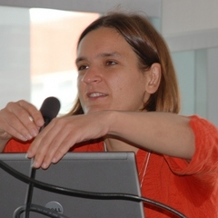

```{r setup, include=FALSE}
options(htmltools.dir.version = FALSE)
knitr::opts_chunk$set(echo=F,
                      message=F,
                      warning=F,
                      fig.retina=3,
                      fig.align = "center")
library("tidyverse")
library(RefManageR)
library(tidyverse)
library(ggthemes)
library(gridExtra)
library(gt)
library(grid)
library(kableExtra)
library(lubridate)
theme_slides <- theme_light() + 
  theme(
    text = element_text(family = "Fira Sans", size = 24)
  )

#u of a palette
colors_ua10 <- function()
{
  #return(c("#007C41", "#FFDB05", "#7D9AAA", "#CA7700", "#165788", "#A8B400",
  #         "#E0D760", "#404545", "#8D3C1E", "#004250"))
  c("#007C41", "#FFDB05", "#7D9AAA","#165788","#404545","#8D3C1E","#3CB6CE")
}

```

# Economics isn't just business or dollars

.center[

]

---

class: inverse, center, middle

# Economics is a way of thinking

# Dollars provide a unit of measure

---

# Economics as a *Way of Thinking*

.pull-left[

- Economics is a .hi-green[way of thinking] based on a few core ideas:
]

---

# Economics as a *Way of Thinking*

- Economics is a .hi-green[way of thinking] based on a few core ideas:
- .hi[People respond to incentives]
    - Money, punishment, taxes and subsidies, risk of injury, reputation, profits, sex, effort, morals

---

# Economics as a *Way of Thinking*

- Economics is a .hi-green[way of thinking] based on a few core ideas:
- .hi[People respond to incentives]
    - Money, punishment, taxes and subsidies, risk of injury, reputation, profits, sex, effort, morals
- .hi[Environments adjust until they are in equilibrium]
    - People make adjustments until their choices are optimal given others’ actions

---

# Incentives Example: Dogs on the subway

.center[


The NYC Subway bans dogs unless they can be ["enclosed in a container"](https://cityroom.blogs.nytimes.com/2009/09/30/answers-about-exploring-new-york-with-your-dog/?_r=0). Source: [Ryan Safner](https://github.com/ryansafner)
]

---

# Incentives Example: Subway II

.center[
 

Pictures [Source](https://www.rover.com/blog/nyc-subway-dogs-fs/), via [Ryan Safner](https://github.com/ryansafner)
]

---

# Incentives Example: England's window tax

.content-box-ua[The British government, in 1696, was looking for a way to impose a wealth-based property tax. 
.hi-green[**Solution**]: They imposed a tax payable based on the number of windows in your dwelling, on the premise that larger houses had more windows.]
--
.center[

]

---

# Economics as a *Way of Thinking*

.pull-left[
- Economics is a .hi-green[way of thinking] based on a few core ideas:
- .hi[Economic agents have goals]
    - Personal satisfaction
    - Profit
- .hi[Constraints impair agents' goal seeking]
    - Budget constraints
    - Production technology
    - Resource constraints
- .hi[Agents optimize subject to constraints]
- .hi[Joint optimization leads to equilibrium]
    
    
    
]

.pull-right[

.center[
]
]

---

# Equilibrium Example I

.pull-left[
.center[

]
]

.pull-right[
- Consider the two routes from St. Albert to the U of A
  - Simplified example: 1000 cars commute
  - Messier Trail / Groat Road travel time: 25 min + 1 min/ 100 extra cars
  - Anthony Henday: 30 minutes (always)
]

---

# Equilibrium Example I

.pull-left[
.center[

]
]

.pull-right[

- Consider the two routes from St. Albert to the U of A
  - Simplified example: 1000 cars commute
  - Messier Trail / Groat Road travel time: 25 min + 1 min/ 100 extra cars
  - Anthony Henday: 30 minutes (always)
- Assume people .hi[optimize]: choose road to **minimize travel time**
]

---

# Equilibrium Example II

.pull-left[
.center[

]
]

.pull-right[
- Consider the two routes from St. Albert to the U of A
  - Simplified example: 1000 cars commute
  - Messier Trail / Groat Road travel time: 25 min + 1 min/ 100 extra cars
  - Anthony Henday: 30 minutes (always)
- Assume people .hi[optimize]: choose road to **minimize travel time**
- .green[**Scenario I**:] **Fewer than 500 cars** choose Groat Road
  - What will people do?
]

---
# Equilibrium Example III

.pull-left[
.center[

]
]

.pull-right[
- Consider the two routes from St. Albert to the U of A
  - Simplified example: 1000 cars commute
  - Messier Trail / Groat Road travel time: 25 min + 1 min/ 100 extra cars
  - Anthony Henday: 30 minutes (always)
- Assume people .hi[optimize]: choose road to **minimize travel time**
- .green[**Scenario I**:] **More than 500 cars** choose Groat Road
  - What will people do?
]

---

# Equilibrium Example IV

.pull-left[
.center[

]
]

.pull-right[
- Consider the two routes from St. Albert to the U of A
  - Simplified example: 1000 cars commute
  - Messier Trail / Groat Road travel time: 25 min + 1 min/ 100 extra cars
  - Anthony Henday: 30 minutes (always)
- Assume people .hi[optimize]: choose road to **minimize travel time**
- .green[**In Equilibrium**:] How many cars are on each road?

]


---

# Equilibrium Example IV

.pull-left[
.center[

]]


.pull-right[
- Consider the two routes from St. Albert to the U of A
  - Simplified example: 1000 cars commute
  - Messier Trail / Groat Road travel time: 25 min + 1 min/ 100 extra cars
  - Anthony Henday: 30 minutes (always)
- Assume people .hi[optimize]: choose road to **minimize travel time**
- What happens .green[**in equilibrium**] as Groat bridge is expanded, reducing commute time to 22 min + 1 min/ 100 extra cars?
]

---

# Wolfers and Stevenson's Basic Principles

<iframe src="https://art19.com/shows/think-like-an-economist/episodes/a5f7943e-17ee-4767-a76b-d0aed7ccf98c/embed" style="width: 100%; height: 200px; border: 0 none;" scrolling="no"></iframe>

---


# Wolfers and Stevenson's Basic Principles

Principle # 1: The cost-benefit principle

<iframe src="https://art19.com/shows/think-like-an-economist/episodes/f3d45e91-e0e7-4189-8853-9ddfb402b640/embed" style="width: 100%; height: 200px; border: 0 none;" scrolling="no"></iframe>

- What are the benefits and costs of each decision?
- Why do we measure in dollars?
   - "Economists love dollars as much as architects love inches"
- Are you getting a good deal?

---

# Wolfers and Stevenson's Basic Principles

Principle # 2: The opportunity cost principle

<iframe src="https://art19.com/shows/think-like-an-economist/episodes/ec2c28a1-ff2b-42e4-b8c2-53dee2110494/embed" style="width: 100%; height: 200px; border: 0 none;" scrolling="no"></iframe>

- Or what?
   - should I take this class or that one?
   - should I major in BUEC or MKTG
   - should I take this job or this internship?
- What's my next-best alternative?

---

# Wolfers and Stevenson's Basic Principles

Principle # 3: The marginal principle

<iframe src="https://art19.com/shows/think-like-an-economist/episodes/ded15b20-2e37-49ae-8db7-1315149c534c/embed" style="width: 100%; height: 200px; border: 0 none;" scrolling="no"></iframe>

- Should we buy/sell one more?
- Should we hire one more staff?
- Should I add another class to my schedule?
- Should I drop a class?

---


# More vocabulary
.pull-left[
- .hi[Comparative statics]: examining changes in equilibria cased by an external change (in incentives, constraints, etc.)
  - Most of what we do in this class will fall into this category
- Comparative dynamic analysis is possible but much more challenging: math is harder when it moves!
]
.pull-right[
.center[

]]

---

# More vocabulary

.pull-left[
- If economic agents can **learn** and **change** their behavior, they will always **switch** to a higher-valued option

- If there are no alternatives that are better, people are at an .hi[optimum]

- If everyone is at an optimum, the system is in .hi[equilibrium]
]

.pull-right[
.center[


]
]


---


# Wolfers and Stevenson's Basic Principles

Principle # 4: The interdependence principle

<iframe src="https://art19.com/shows/think-like-an-economist/episodes/f20b38ed-9218-4878-971e-46388b277e8f/embed" style="width: 100%; height: 200px; border: 0 none;" scrolling="no"></iframe>

- All else equal...but is it?
- What happens to my best decision when other factors change?
- Does my value depend on what others do? Network externalities?
---


# Why We Model I

.pull-left[

- Economists often "speak" in models that explain and predict human behavior

- The language of models is mathematics

- Mathematical inference is expressed through equations and graphs

- This is what scares students most about economics. Don't let it scare you.

]

.pull-right[
.center[

]
]

---

# Why We Model II

.pull-left[

- Economists use conceptual models: fictional constructions to logically examine consequences

- Economics is broader than just mathematical models:
    - Economists run experiments
    - Economists analyze data
    - Economists make predictions
    
- Math is a tool, it's not the goal
]

.pull-right[
.center[

]
Esther Duflos, Nobel-prize-winning economist (Source: MIT)
]

---

# Remember: All Models are Wrong!

.content-box-red[
.red[**Caution**:] Don't conflate models with reality!
]
- Models help us *understand* reality.

- A good economist is always aware of:
    - the limits of their model
    - the key underlying assumptions
    - " _ceteris paribus_ " (all else equal)
    - "...and then what?"   (is the system in equilibrium?)
    - "...compared to what?" (counterfactual analysis)

---
# Economics uses, but is not limited to, math


```{r, fig.width=12}
#this is throwing a font error. why?

green <- "#007C41"
gold <-  "#FFDB05"

venn_colors <- c(green,gold)
venn_lines <- rep("solid", 10)
# Locations of circles
venn_df <- tibble(
  x  = c( 0.0,   2.0),
  y  = c( 0.0,   0.0),
  r  = c( 2.0,   2.0),
  l  = c( "Math \n Modeling", "Thinking Like \n an Economist"),
  xl = c( -1.0,    3.0),
  yl = c( 0.0,   0.0))
# Venn
ggplot(data = venn_df, aes(x0 = x, y0 = y, r = r, fill = l), color = "black") +
ggforce::geom_circle(aes(linetype = l), alpha = 0.3, size = 0.75) +
theme_void() +
theme(legend.position = "none") +
scale_fill_manual(values = venn_colors) +
scale_color_manual(values = venn_colors) +
scale_linetype_manual(values = venn_lines) +
  geom_text(aes(x = xl, y = yl, label = l), size = 8) +
coord_equal()
```


---
# Positive and Normative Statements
- Economics alone can't tell you the **right** decision 
- A positive statement is a statement of what **is** or what **will happen** and describes reality.
   - If you increase the costs of production, consumer prices will go up.
- Positive statements can reflect **uncertainty** about outcomes
- A normative statement concerns what somebody believes **should** happen:
   - “The government should tax greenhouse gas emissions.”
   - Normative statements cannot be tested because they imply value judgments which cannot be refuted by evidence.
- Normative statements can inform objective functions
   - A decision-maker might look for a policy which does not increase inequality
   - Economists can provide constrained advice: this policy accomplishes your objective and **is unlikely to** increase inequality
